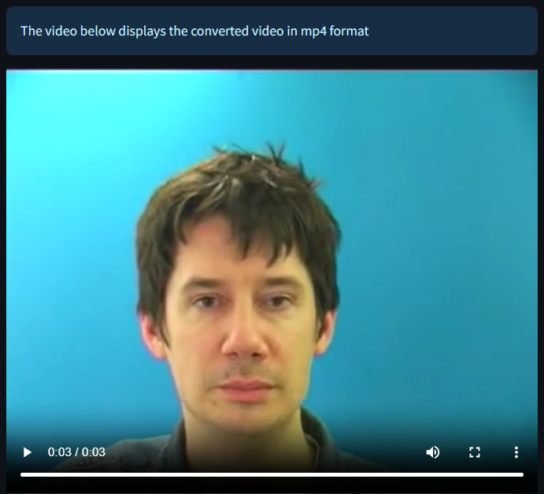

# CS550: Machine Learning - Final Project

**Indian Institute of Technology, Bhilai**

## Advance Lipreading (Sentence-Level)

- **Project GitHub Link:** [https://github.com/Monkey-D-Coders/Lip-Reader](https://github.com/Monkey-D-Coders/Lip-Reader)

### Team Members:
- **Omm Prakash Sahoo (12141190)**
- **Duruseti Sai Srihan (12140620)**
- **Nita Bar (12141170)**

---

## Table of Contents

1. [Introduction](#introduction)
2. [Dataset](#dataset)
3. [Data Augmentation](#data-augmentation)
4. [Data Pipeline](#data-pipeline)
5. [Deep Neural Network Architecture](#deep-neural-network-architecture)
6. [Model Training](#model-training)
7. [Model Performance](#model-performance)
8. [Accuracy Analysis](#accuracy-analysis)
9. [Cherry on Top](#cherry-on-top)
10. [App Development](#app-development)
    - [Video Selection Bar](#video-selection-bar)
    - [Left Vertical Drawer](#left-vertical-drawer)
    - [Video Preview](#video-preview)
    - [What Your Model Actually Takes as Input](#what-your-model-actually-takes-as-input)
    - [Output / Prediction](#output--prediction)
    - [App UI](#app-ui)
11. [Tasks Done In Final Submission](#tasks-done-in-final-submission)
12. [Conclusion](#conclusion)
13. [Individual Contribution to the Project](#individual-contribution-to-the-project)

---

## Introduction

Lip Reading is a fascinating project aiming to predict sentences from input video data without using audio information. In this Final Submission report, we provide an overview of the project, the dataset used, data preprocessing steps, and all the steps in designing and training the deep neural network. Additionally, we present a brief overview of our developed app.

## Dataset

The project uses the Grid corpus, which includes 1000 short videos and corresponding alignment files for 34 individuals, totaling 34000 videos and alignments, comprising 18 men and 16 women.

**Links:**
- Research Paper: [https://arxiv.org/abs/1611.01599](https://arxiv.org/abs/1611.01599)
- Dataset: [http://spandh.dcs.shef.ac.uk/gridcorpus](http://spandh.dcs.shef.ac.uk/gridcorpus)

## Data Augmentation

### Video Preprocessing
- Extract 75 uniform frames from every video.
- Convert each frame to grayscale.
- Crop only the mouth region from each frame manually.
- Standardize the data.

### Unique Character to Integer Encoding
- Map each character to an integer.
- Encode vocabularies to their respective indices.
- Replace characters not in the vocabulary with an empty string.

### Decoding
- Decoding is done by returning the corresponding character for each integer value.

### Alignment Preprocessing
- Alignments contain words corresponding to time stamps.
- Words are encoded in the same way as unique character to integer encoding, considering silence as a space in between.

## Data Pipeline
- Select 500 random videos from each of the 34 folders.
- Use 450 videos for training and 50 videos for validation.
- Perform the specified preprocessing.
- Add a prefetching step to the dataset for optimized performance.

## Deep Neural Network Architecture

After researching and training several models, we have selected the current best model for phase one of submission and for the final submission.

## Model Training
- Utilizing the CTC loss function.
- Implementing a learning rate scheduler.
- Periodically saving the model.

## Model Performance

On epoch 1:
- Original: bin white at t two now
- Prediction: le e e e e eo

On epoch 50:
- Original: bin blue by s six please
- Prediction: bin blue by six please

On epoch 96:
- Original: place green in d five soon
- Prediction: place green in d five soon

## Accuracy Analysis

We used the standard levenshtein-distance algorithm to evaluate word and sentence accuracy of both of our models.

**Accuracy of Model submitted for phase 1:**
- Mean Word Error Rate: 14.40%
- Mean Sentence Error Rate: 6.06%
- Word-level Accuracy: 85.6%
- Sentence-level Accuracy: 93.94%

**Accuracy of Model submitted for Final Submission:**
- Mean Word Error Rate: 1.77%
- Mean Sentence Error Rate: 0.67%
- Word-level Accuracy: 98.23%
- Sentence-level Accuracy: 99.33%

**Cherry on Top:**
Our model is capable enough to predict sentences from given Video (i.e., without any audio) almost in real-time while combined with our app.

## How Did We Achieve Such Accuracy

We trained our model on 34 individual people with different skin tones, different accents, different genders, and with sentences comprising most random words possible, making our model robust enough to predict on any video. Our optimization at different levels not only decreased the training time from 12 hours for 500 videos to 9 hours for 1000 videos, which is almost 2.7x faster training speed, but also our unique encoding and decoding technique made predictions fast enough to predict over a given video almost in real time.

## App Development

**NeuroSync Lipscape:** An app that synchronizes sentence predictions with your lip movement by harnessing the power of neural networks.

### App Contents

#### Video Selection Bar

By this bar, you can select to predict a sentence on an existing video or upload* your own video on which you want to predict a sentence.

#### Left Vertical Drawer
For now, it is just showcasing the app and its description, but later we will make it more functional, giving it more functionality like choosing your model to predict or it will be open for integration with other apps and also act as a nav-bar for our app. You can find this at the top left part of the app.

#### Video Preview
In this tab, there will be a preview of the video that you have selected/uploaded*. In this section, to make sure we can process videos with any extensions, we are converting that to MP4 format. You can find this at the middle left part of the app.

#### What Your Model Actually Takes as Input
In this section, we have made users visualize the model input by animating the 75 preprocessed images to a GIF with 10 frames per second. You can find this at the middle right part of the app.

#### Output / Prediction
In this section, we have shown raw model output as a tensor and along with decoded sentence corresponding to that tensor. You can find this at the bottom right part of the app.

### App UI
This is the complete UI of our current developed app:

## Tasks Done In Final Submission
- Training model after fine-tuning it on 34000 videos (before it was only trained on 1000).
- Did accuracy analysis to know actual sreangth of model.
- Developed an full stack app to utilize the model in real life for hearing impared or deaf people.
- We did exlore possibility of predidcting on any length (possibly very big i.e. in Hours) and came with solution to
just classify each neighbour frame to one of 44 unique phonemes but unavalibility of proper dataset was major issue
for us and we did try to make our own dataset after which we did end up making a 10 minutes long video with
manual transcripting but due to our accent and low quality of datasets ( like touching or licking lips in between and
many more reasons) we could not achieve the accuracy near this model (47%).
- And also many phonemes in english are similar when pronouncing so that was also measure issue also we couldnot
completely decode the predicted sequence also.
- Due to above reasons and many more we decided to fine-tune and make it perfect previous model only which we
successfully did and planning to deploy app after giving it some more finishing touches.

## Conclusion

Our lip reading project successfully achieved advanced accuracy levels, reducing mean word and sentence error rates to 1.77% and 0.67%, respectively. The model, trained on a diverse dataset, demonstrated robustness and adaptability. Real-time sentence predictions were realized through the innovative "NeuroSync Lipscape" app, offering accessibility for the hearing-impaired. The unique character-to-integer encoding and data preprocessing techniques significantly contributed to model performance. The proposed Bi-GRU LSTM feature extractor, manual crop for mouth region extraction, and learning rate scheduler enhanced the model's capabilities. The app's user-friendly interface integrates video preview, model input visualization, and detailed predictions. Our collaborative efforts, including individual contributions and constant model monitoring, ensured project success. Overall, our work not only advances lip reading accuracy but also translates research into a practical, real-time solution for improved accessibility.

## Individual Contribution to the Project

### Omm
- Proposed to use manual crop to extract the mouth region.
- Proposed to use a dictionary with mapping of every character to an integer.
- Developed a modified CTC loss function for our model.
- Proposed to use Bi-GRU for better understanding of the encoding of the used dataset by the model.
- Contributed to improving model performance by constantly monitoring losses and model performance.
- Conducted accuracy analysis.
- Developed a full-stack app for using our model in real life.

### Srihan
- Proposed to use auto crop using 'cv2.CascadeClassifier' for extracting the mouth region.
- Developed a Learning rate scheduler.
- Proposed a model using a classic LSTM feature extractor.
- Contributed to improving model performance by constantly monitoring losses and model performance.
- Helped in the development of a full-stack app for using our model in real life.

### Nita
- Proposed to use 'base64' for encoding and decoding.
- Proposed to use a pretrained model for better results.
- Developed a function that predicts over random validation sentences and saves model weights at the end of every epoch.
- Contributed to improving model performance by constantly monitoring losses and model performance.
- Helped in the development of a full-stack app for using our model in real life.

[Project GitHub Link](https://github.com/Monkey-D-Coders/Lip-Reader)

